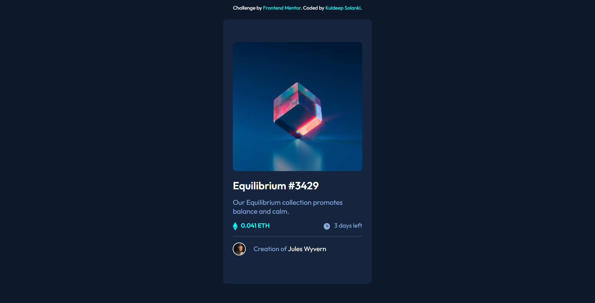
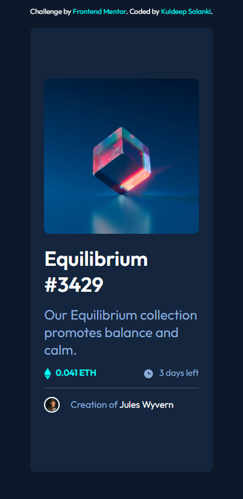

# Frontend Mentor - NFT preview card component solution

This is a solution to the [NFT preview card component challenge on Frontend Mentor](https://www.frontendmentor.io/challenges/nft-preview-card-component-SbdUL_w0U). Frontend Mentor challenges help you improve your coding skills by building realistic projects.

## Table of contents

- [Frontend Mentor - NFT preview card component solution](#frontend-mentor---nft-preview-card-component-solution)
  - [Table of contents](#table-of-contents)
  - [Overview](#overview)
    - [The challenge](#the-challenge)
    - [Screenshot](#screenshot)
    - [Links](#links)
  - [My process](#my-process)
    - [Built with](#built-with)
    - [What I learned](#what-i-learned)
    - [Useful resources](#useful-resources)
  - [Author](#author)

## Overview

### The challenge

Users should be able to:

- View the optimal layout depending on their device's screen size
- See hover states for interactive elements

### Screenshot

Final version on desktop:

Final version on smaller devices:

### Links

- Solution URL: [Linked Frontend Mentor Challenge Solution](https://www.frontendmentor.io/solutions/implemented-responsive-design-using-less-code-in-media-queries-sH_b_4gMu)
- Live Site URL: [Deployed on Netlify: NFT Preview Card Component](https://nft-card-component-kuldp18.netlify.app)

## My process

### Built with

- Semantic HTML5 markup
- CSS custom properties
- Flexbox

### What I learned

- Brushed up my flexbox skills
- Learnt about responsive design
- Learnt about image overlays

### Useful resources

- [Image Overlay Effect](https://www.youtube.com/watch?v=-wV4Har4xkQ) - Since I didn't know about complex topics like ::after and ::before elements, I just found this great youtube video which just works for this particular challenge. It's not the best but it does the job.
- [Best Flexbox Guide you can have](https://css-tricks.com/snippets/css/a-guide-to-flexbox/) - If you don't know about flexbox, this is the best guide or cheatsheet you can find on the entire internet. It's great for pros as well as for beginners.

## Author

- Website - [Kuldeep Solanki](https://ksolanki.netlify.app)
- Frontend Mentor - [@kuldp18](https://www.frontendmentor.io/profile/kuldp18)
- Twitter - [@itskuldeep8](https://www.twitter.com/itskuldeep8)
- Instagram - [@\_kuldeep_solanki](https://www.instagram.com/_kuldeep_solanki)
